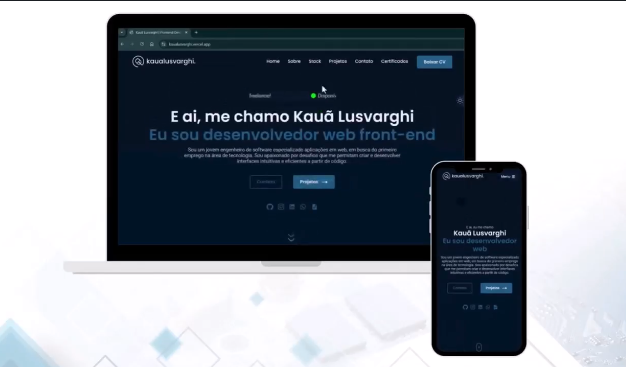

# Portfólio Pessoal

  

  

## Descrição  
Este é o meu portfólio pessoal, onde você encontrará:  
- Informações sobre mim  
- Projetos desenvolvidos e minha trajetória profissional  
- Habilidades técnicas (hardskills)  
- Seção de contato com minhas redes sociais  
- Sessão exibindo certificados na área de desenvolvimento  

## Status  
> Em desenvolviemnto de novas features

## Deploy  
- [Acesse o projeto aqui](https://kaualusvarghi.vercel.app/)  

## Roadmap  
- Criação de uma API em nodejs para adicionar conteúdo via web sem precisar mexer no código
- Mudança no design, principalmente para melhorar a experiência mobile
  
## Tecnologias  
- **React**  
- **Vite**  
- **TypeScript**  
- **Styled Components**
- **React Icons**  
- **Axios**  
- **Emailjs**  
  
## Funcionalidades  
- Navegação entre seções  
- Exibição de conteúdo interativo (efeitos visuais e interações)  
- Envio de e-mail direto para mim  
- Roteamento entre páginas  
- Troca de tema (dark/light)  
- Design responsivo para mobile  

## Contato  
Se tiver uma ideia ou qiser trocar uma ideia sobre tecnologia:
- Email: kauaolusvarghi@gmail.com
- Linkedin: [kaua-lusvarghi-frontend-dev/](https://www.linkedin.com/in/kaua-lusvarghi-frontend-dev/)
